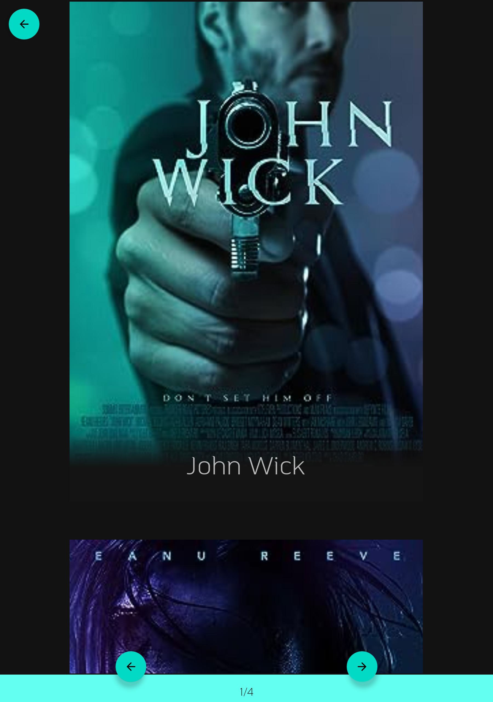
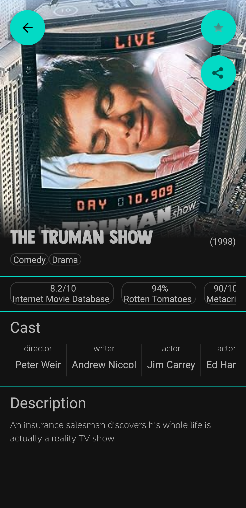
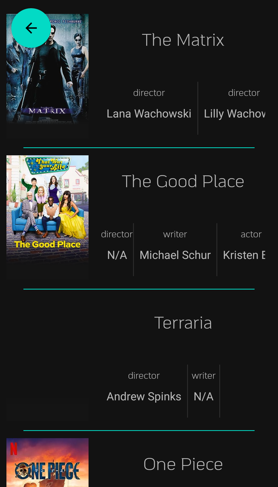

# Simple Media Browser


## Introduction

Simple Media Browser is an Android application designed for browsing and searching movies and other media content through the OMDB API. Initially developed as a programming assignment in 2020, the codebase, while still imperfect, has undergone some cleanup efforts in preparation for archiving the repository. It's important to emphasize that this project is now in an archival state and will not receive further updates or maintenance.

## Screenshots

Here are some screenshots of significant views in the app:

### Search Results



> You can search for movies and media content by entering keywords in the search bar, and the app displays a list of matching results.

### Media Details



> The media details screen provides information about a selected movie or media item, including its title, description, ratings, and more.

### Favorites list



> The favorites page is a dedicated section where you can manage and view their favorite movies and media content.

## OMDB API Key

Simple Media Browser relies on the OMDB API to fetch movie and media data. You can obtain your OMDB API key by signing up on the OMDB API website.
To use Simple Media Browser, you will need to provide your OMDB API key in the `local.properties` file of the project. Here's how to do it:

1. Open the project in Android Studio.

2. Locate the `local.properties` file in the root directory of the project.

3. Add the following line to the `local.properties` file, replacing `YOUR_OMDB_API_KEY` with your actual OMDB API key:

   ```properties
   OMDB_KEY=YOUR_OMDB_API_KEY
   ```
4. Save the `local.properties` file.

5. Build and run the application.

## License
This project is licensed under the MIT License - see the LICENSE file for details.